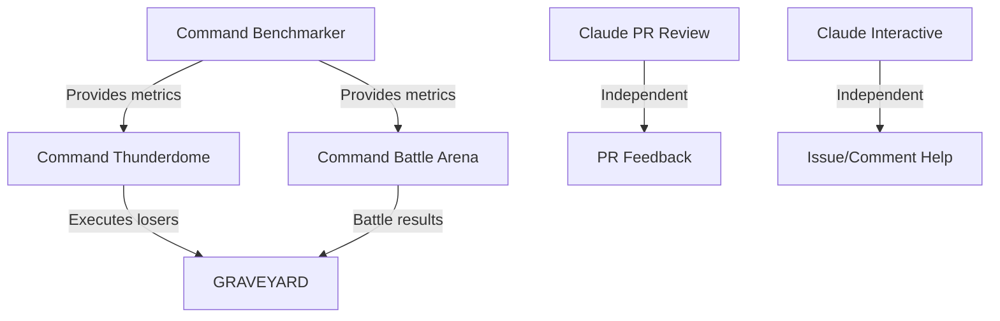

# GitHub Workflows Documentation

This repository contains several GitHub Actions workflows for different purposes:

## 🤖 Claude AI Workflows

### 1. Claude Automated PR Review (`claude-pr-review.yml`)
- **Purpose**: Automatically reviews all pull requests when opened, synchronized, or reopened
- **Trigger**: Automatic on PR events
- **Use Case**: Get immediate code review feedback without manual intervention
- **Requirements**: 
  - `CLAUDE_CODE_OAUTH_TOKEN` secret configured
  - Permissions: `contents: read`, `pull-requests: read`, `issues: read`, `id-token: write`

### 2. Claude Interactive Assistant (`claude.yml`)
- **Purpose**: Responds to @claude mentions in comments and issues
- **Triggers**: 
  - When someone mentions `@claude` in a comment
  - When an issue is labeled with `claude`
  - When someone assigns an issue to Claude
- **Use Case**: Get on-demand help with specific questions or tasks
- **Requirements**: 
  - `CLAUDE_CODE_OAUTH_TOKEN` secret configured
  - Permissions: `contents: read`, `pull-requests: read`, `issues: read`, `id-token: write`, `actions: read`

## ⚔️ Command Performance Workflows (Thunderdome System)

### 3. Command Performance Benchmarker (`command-benchmarker.yml`)
- **Purpose**: Benchmarks command performance with statistical analysis
- **Trigger**: Every 30 minutes or manual dispatch
- **Use Case**: Collect performance metrics and identify underperforming commands
- **Features**: 
  - Token consumption tracking
  - Execution time analysis
  - Success rate monitoring
  - Complexity scoring

### 4. Command Thunderdome (`command-thunderdome.yml`)
- **Purpose**: Executes underperforming commands based on benchmark data
- **Trigger**: 4 times daily at random times or manual dispatch
- **Modes**:
  - `random_chaos`: Random selection of 6 commands
  - `targeted_strike`: Specific underperformers
  - `mass_extinction`: All commands below threshold
  - `battle_royale`: Tournament mode
- **Features**: Data-driven execution decisions with full evidence

### 5. Command Battle Arena (`command-battle-arena.yml`)
- **Purpose**: Head-to-head battles between similar commands
- **Trigger**: Thursdays at noon or manual dispatch
- **Battle Types**:
  - `category_clash`: Similar commands compete
  - `performance_duel`: Speed competitions
  - `efficiency_war`: Token cost battles
  - `complexity_combat`: Simplicity contests
- **Features**: Statistical significance required for victory

## 🔧 Setup Instructions

### Required Secrets
1. **`CLAUDE_CODE_OAUTH_TOKEN`**: Required for all Claude workflows
   - Get from [Claude Code](https://claude.ai/code)
   - Add to repository secrets: Settings → Secrets → Actions

### Testing Workflows
```bash
# Test Claude PR review (will run on next PR)
git checkout -b test-pr
echo "test" > test.txt
git add test.txt
git commit -m "Test PR for Claude review"
git push origin test-pr
# Create PR via GitHub UI

# Test Claude interactive (comment on any issue/PR)
# Just comment: "@claude can you help with this?"

# Test Command Benchmarker
gh workflow run command-benchmarker.yml

# Test Thunderdome
gh workflow run command-thunderdome.yml --field execution_mode=random_chaos

# Test Battle Arena
gh workflow run command-battle-arena.yml --field battle_type=category_clash
```

## 📊 Workflow Comparison

| Workflow | Purpose | Trigger | Frequency | Manual Trigger |
|----------|---------|---------|-----------|----------------|
| Claude PR Review | Automatic PR reviews | PR events | Every PR | No |
| Claude Interactive | @claude mentions | Comments/labels | On-demand | No |
| Command Benchmarker | Performance metrics | Schedule | Every 30 min | Yes |
| Command Thunderdome | Execute bad commands | Schedule | 4x daily | Yes |
| Command Battle Arena | Command competitions | Schedule | Weekly | Yes |

## 🚨 Troubleshooting

### Common Issues

1. **OIDC Token Error**
   - Error: `Unable to get ACTIONS_ID_TOKEN_REQUEST_URL env variable`
   - Solution: Ensure `id-token: write` permission is in the workflow

2. **Claude Not Responding**
   - Check if `CLAUDE_CODE_OAUTH_TOKEN` is configured
   - Verify the trigger phrase matches (default: `@claude`)
   - Check workflow runs in Actions tab for errors

3. **Workflow Not Triggering**
   - Verify the event type matches your action
   - Check if conditions in `if:` statements are met
   - Review GitHub Actions logs for skipped jobs

## 🔄 Workflow Dependencies



## 📝 Notes

- All Command workflows use data-driven decisions with statistical significance (p < 0.05)
- Claude workflows are independent and can run simultaneously
- The Thunderdome system is designed to be savage but fair - all executions backed by evidence
- Workflows are configured to use `github-actions[bot]` for commits

---

Last Updated: 2025-01-14