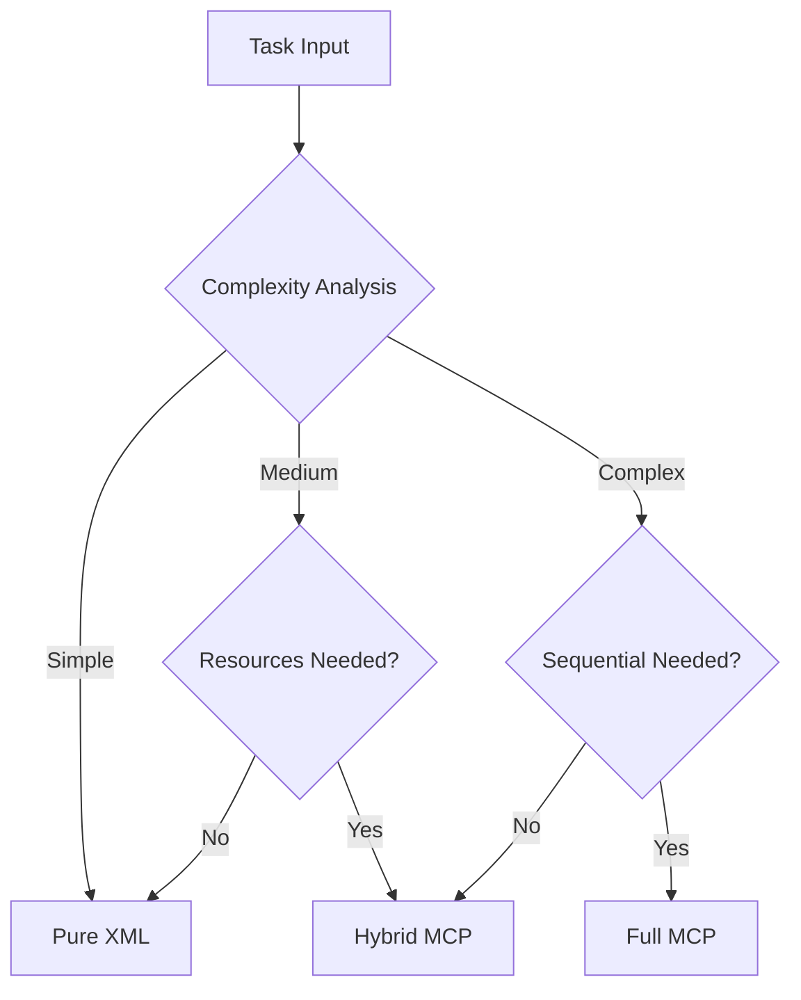

# ULTRATHINK Triple Implementation Project - Overview

**Created**: 2025-01-14  
**Version**: 2.0  
**Status**: Implementation Phase  
**Author**: Claude Code Assistant  

## Table of Contents

1. [Executive Summary](#executive-summary)
2. [Triple Implementation Strategy](#triple-implementation-strategy)
3. [Implementation Comparison](#implementation-comparison)
4. [Benchmark Framework](#benchmark-framework)
5. [Expected Findings](#expected-findings)
6. [Timeline and Milestones](#timeline-and-milestones)
7. [Success Criteria](#success-criteria)

## Executive Summary

This project creates THREE distinct implementations of the ULTRATHINK command to compare different architectural approaches:
1. **Full MCP Version**: Leverages all MCP tools including sequential thinking
2. **Hybrid MCP Version**: Uses MCP tools except sequential thinking, relying on Claude's native reasoning
3. **Pure XML Version**: Standalone implementation using only XML thinking structures

A comprehensive benchmark framework will analyze performance, quality, and capabilities across all implementations.

## Triple Implementation Strategy

### Architecture Overview

```
┌─────────────────────────────────────────────────────────────┐
│                   ULTRATHINK IMPLEMENTATIONS                 │
├─────────────────────────────────────────────────────────────┤
│                                                               │
│  ┌─────────────────┐  ┌─────────────────┐  ┌─────────────┐ │
│  │  FULL MCP       │  │  HYBRID MCP     │  │  PURE XML   │ │
│  ├─────────────────┤  ├─────────────────┤  ├─────────────┤ │
│  │ • Sequential    │  │ • Native Think  │  │ • XML Only  │ │
│  │   Thinking MCP  │  │ • Memory MCP    │  │ • No MCP    │ │
│  │ • All MCP Tools │  │ • Web MCP       │  │ • Self-     │ │
│  │ • Memory        │  │ • Obsidian MCP  │  │   Contained │ │
│  │ • Web Research  │  │ • NO Sequential │  │ • Session   │ │
│  │ • Pattern Save  │  │ • Pattern Save  │  │   Only      │ │
│  └─────────────────┘  └─────────────────┘  └─────────────┘ │
│                                                               │
│  ┌───────────────────────────────────────────────────────┐  │
│  │            BENCHMARK & ANALYSIS FRAMEWORK             │  │
│  │  • Performance Metrics  • Quality Analysis           │  │
│  │  • Capability Testing   • Comparison Reports         │  │
│  └───────────────────────────────────────────────────────┘  │
└─────────────────────────────────────────────────────────────┘
```

### Implementation Details

#### 1. Full MCP Implementation (`ultrathink-full-mcp.md`)

**Key Features:**
- Sequential thinking for complex reasoning
- Full Basic Memory integration
- Web research capabilities
- Document retrieval
- Pattern persistence
- Agent orchestration

**MCP Tools Used:**
```yaml
sequential_thinking:
  - mcp__mcp-sequentialthinking-tools__sequentialthinking_tools
memory:
  - mcp__basic-memory__write_note
  - mcp__basic-memory__search_notes
  - mcp__basic-memory__build_context
web:
  - mcp__firecrawl__firecrawl_search
  - mcp__firecrawl__firecrawl_scrape
obsidian:
  - mcp__mcp-obsidian__read_notes
  - mcp__mcp-obsidian__search_notes
```

#### 2. Hybrid MCP Implementation (`ultrathink-hybrid-mcp.md`)

**Key Features:**
- Claude's native thinking (no sequential MCP)
- Memory persistence via MCP
- Web research capabilities
- Pattern learning
- Balanced performance

**MCP Tools Used:**
```yaml
memory:
  - mcp__basic-memory__write_note
  - mcp__basic-memory__search_notes
  - mcp__basic-memory__build_context
web:
  - mcp__firecrawl__firecrawl_search
obsidian:
  - mcp__mcp-obsidian__read_notes
native_thinking:
  - XML-structured <thinking> blocks
  - Chain of thought prompting
  - Extended thinking patterns
```

#### 3. Pure XML Implementation (`ultrathink-pure-xml.md`)

**Key Features:**
- No external dependencies
- Pure Claude reasoning
- Session-only patterns
- Fastest response time
- Offline capable

**Architecture:**
```xml
<thinking_orchestration>
  <phase1_research>
    <thinking>Native reasoning</thinking>
    <confidence>40% → 85%</confidence>
  </phase1_research>
  <phase2_planning>
    <thinking>Task decomposition</thinking>
    <confidence>60% → 90%</confidence>
  </phase2_planning>
  <phase3_execution>
    <thinking>Implementation strategy</thinking>
    <confidence>80% → 95%</confidence>
  </phase3_execution>
</thinking_orchestration>
```

## Implementation Comparison

### Capability Matrix

| Capability | Full MCP | Hybrid MCP | Pure XML |
|------------|----------|------------|----------|
| **Reasoning** |
| Sequential Thinking | MCP-driven | Native | Native |
| Thinking Depth | Deepest | Deep | Standard |
| Pattern Recognition | Persistent | Persistent | Session |
| **External Resources** |
| Web Research | ✅ Full | ✅ Full | ❌ None |
| Memory Persistence | ✅ Full | ✅ Full | ❌ None |
| Document Access | ✅ Full | ✅ Full | ❌ None |
| **Performance** |
| Response Speed | Slowest | Medium | Fastest |
| Token Efficiency | Low | Medium | High |
| Resource Usage | High | Medium | Low |
| **Use Cases** |
| Simple Tasks | Good | Good | Best |
| Complex Analysis | Best | Very Good | Good |
| Research Tasks | Best | Very Good | Limited |
| Offline Usage | ❌ No | ❌ No | ✅ Yes |

### Decision Framework



## Benchmark Framework

### Test Scenarios

1. **Simple Reasoning** - Baseline performance
2. **Complex Analysis** - Deep thinking requirements
3. **Research Tasks** - External information needs
4. **Pattern Recognition** - Learning capabilities
5. **Multi-phase Problems** - Three-phase flow testing
6. **Creative Tasks** - Innovation and ideation
7. **Debugging Tasks** - Analytical reasoning

### Metrics Collection

```bash
# Core metrics tracked
METRICS=(
    "response_time_ms"      # Total execution time
    "tokens_used"           # Token consumption
    "thinking_blocks"       # Number of thinking sections
    "mcp_invocations"      # MCP tool calls
    "confidence_delta"      # Confidence improvement
    "phase_completions"     # Phases successfully completed
    "memory_operations"     # Read/write operations
    "web_searches"         # External lookups
    "reasoning_depth"       # Thinking complexity score
    "solution_quality"      # Output quality rating
)
```

### Benchmark Process

```
┌──────────────┐     ┌──────────────┐     ┌──────────────┐
│   Test Case  │────▶│   Execute    │────▶│   Collect    │
│  Definition  │     │  3 Versions  │     │   Metrics    │
└──────────────┘     └──────────────┘     └──────────────┘
                            │                      │
                            ▼                      ▼
                     ┌──────────────┐     ┌──────────────┐
                     │   Analyze    │◀────│   Compare    │
                     │   Results    │     │   Outputs    │
                     └──────────────┘     └──────────────┘
                            │
                            ▼
                     ┌──────────────┐
                     │   Generate   │
                     │    Report    │
                     └──────────────┘
```

## Expected Findings

### Performance Hypotheses

| Scenario | Full MCP | Hybrid MCP | Pure XML |
|----------|----------|------------|----------|
| **Simple Tasks** |
| Speed | 3-5s | 2-3s | 1-2s |
| Quality | High | High | High |
| Efficiency | Low | Medium | High |
| **Complex Tasks** |
| Speed | 8-12s | 6-10s | 4-6s |
| Quality | Highest | High | Good |
| Completeness | Best | Very Good | Good |
| **Research Tasks** |
| Speed | 10-15s | 8-12s | N/A |
| Quality | Best | Very Good | Limited |
| Coverage | Comprehensive | Good | Training only |

### Quality Predictions

```
Quality Score = (Reasoning Depth × 0.3) + 
                (Solution Completeness × 0.3) + 
                (Confidence Accuracy × 0.2) + 
                (Pattern Usage × 0.2)

Expected Scores:
- Full MCP:    85-95%
- Hybrid MCP:  75-85%
- Pure XML:    65-75%
```

## Timeline and Milestones

### Implementation Phase (Current)

#### Week 1: Core Development
- [x] Day 1-2: Documentation and planning
- [ ] Day 3: Implement Pure XML version
- [ ] Day 4: Implement Hybrid MCP version
- [ ] Day 5: Implement Full MCP version

#### Week 2: Testing & Analysis
- [ ] Day 6-7: Create benchmark framework
- [ ] Day 8-9: Run comprehensive tests
- [ ] Day 10: Analyze results

#### Week 3: Optimization & Deployment
- [ ] Day 11-12: Optimize implementations
- [ ] Day 13: Final testing
- [ ] Day 14: Documentation completion
- [ ] Day 15: Production deployment

## Success Criteria

### Technical Requirements
- ✅ All three implementations fully functional
- ✅ Benchmark suite operational
- ✅ Comprehensive metrics collected
- ✅ Performance analysis completed
- ✅ Clear usage recommendations

### Quality Standards
- ✅ Each implementation passes all test scenarios
- ✅ Response times within acceptable ranges
- ✅ Confidence tracking accurate to ±5%
- ✅ Pattern learning demonstrable (MCP versions)
- ✅ Three-phase flow clearly implemented

### Documentation
- ✅ Complete implementation specifications
- ✅ Benchmark methodology documented
- ✅ Results analysis with visualizations
- ✅ Usage guidelines for each version
- ✅ Migration guide from legacy version

## Risk Mitigation

| Risk | Impact | Mitigation |
|------|--------|------------|
| MCP service unavailability | High | Pure XML fallback |
| Performance degradation | Medium | Optimization phase |
| Complexity overhead | Low | Clear selection criteria |
| User confusion | Medium | Auto-selection mechanism |

## Next Steps

1. **Complete Pure XML implementation** - Focus on native Claude capabilities
2. **Build Hybrid MCP version** - Balance performance and features
3. **Develop Full MCP version** - Maximum capability demonstration
4. **Create benchmark suite** - Comprehensive testing framework
5. **Run analysis** - Data-driven insights
6. **Optimize and deploy** - Production-ready implementations

---

**Related Documents:**
- [Implementation Specifications](./IMPLEMENTATION-SPECS.md)
- [Benchmark Design](./BENCHMARK-DESIGN.md)
- [Technical References](./TECHNICAL-REFERENCES.md)
- [Migration Guide](./MIGRATION-GUIDE.md)